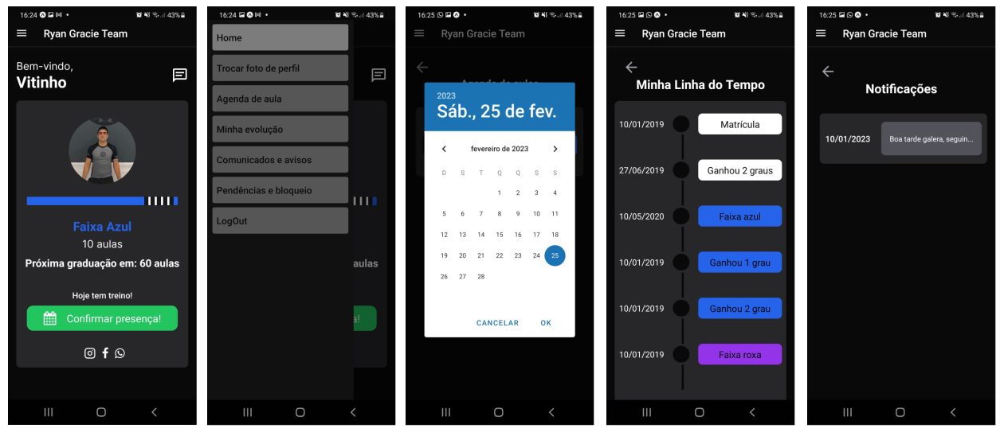

# Aplicativo de Controle de Alunos - Jiu Jitsu!

<h1 align="center">
  
</h1>

O App tem por finalidade possibilitar o agendamento e controle de frequência, bem como gerar alertas de vencimento de mensalidade, exibir a linha do tempo do aluno e suas respectivas graduações, compartilhar mensagens e afins. 

### 🚧 Projeto em desenvolvimento:

Etapa atual:

- [x] Criação de Layout (Figma);
- [x] Codificação do Layout no VS Code;
- [x] Ajustes de Estado dos Componentes;
- [ ] Criação do Backend (BaaS Firebase);
- [ ] Consumo de API (axios);
- [ ] Deploy do aplicativo;

### 🛠 Tecnologias

As seguintes ferramentas foram usadas na construção do projeto:
- [React Native](https://reactnative.dev/)
- [JavaScript](https://developer.mozilla.org/pt-BR/docs/Web/JavaScript)
- [Drawer Navigation](https://reactnavigation.org/docs/drawer-navigator)
- [TawilindCSS / Nativewind](https://www.nativewind.dev/)
- [Modal DateTime Picker - Calendar](https://github.com/mmazzarolo/react-native-modal-datetime-picker)
- [Firebase](https://firebase.google.com/)
- [Axios](https://axios-http.com/ptbr/docs/intro)

### 👨🏾‍💻 Autor
---

 

Projeto em desenvolvimento, sendo feito com ❤️ por Vitor Ribeiro 👋🏽 Entre em contato!

