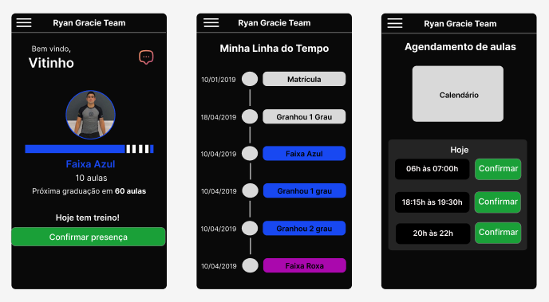

# Aplicativo de Controle de Alunos - Jiu Jitsu!

<h1 align="center">
  
</h1>

O App tem por finalidade possibilitar o agendamento e controle de frequência, bem como gerar alertas de vencimento de mensalidade, exibir a linha do tempo do aluno e suas respectivas graduações, compartilhar mensagens e afins. 

- FERRAMENTAS:

 * React Native;
 * Typescript;
 * TailwindCSS (Nativewind);
 * Drawer Navigation;
 * Modal Date Time Picker (Calendar)
 * Dayjs;
 * Backend (BaaS - Firebase);

* Projeto em desenvolvimento;
* Atualmente: desenvolvimento das telas
